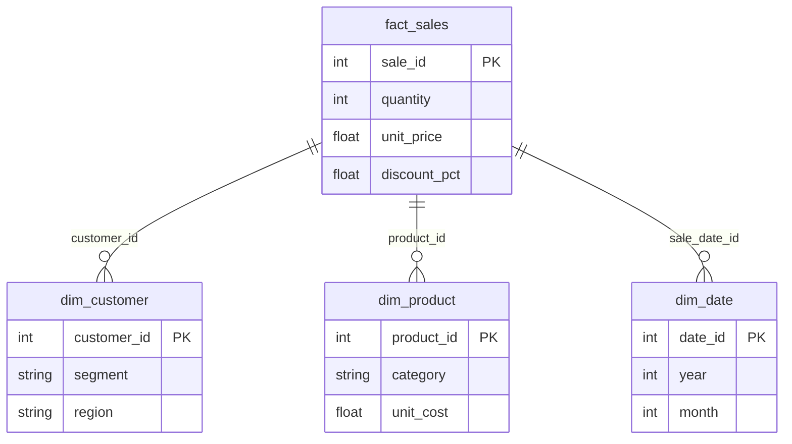

# BI & SQL Analytics Portfolio

Portfolio for **Technical Data Analyst / BI Analyst** roles: SQL, KPI reporting, data quality, and dimensional modeling. Three projects—SQL lab (retail star schema), data quality and reconciliation, API-to-BI pipeline—show how I structure data, validate it, and turn it into reporting-ready outputs.

**Technical Data Analyst / BI Analyst** focused on SQL, KPI reporting, data quality, and dimensional modeling.

*Example KPI dashboard layout (generated from the included retail dataset for visual preview).*

*Star schema used across projects (SQL Lab, Data Quality pack, API pipeline). Revenue = quantity × unit_price × (1 − discount_pct/100).*

---

## Focus

- **SQL** — Star schema, JOINs, aggregations, CTEs, window functions, validation logic.
- **KPI reporting** — Revenue, margin, reconciliation; metrics by customer, product, period.
- **Data quality** — Validation and reconciliation before numbers reach reports.
- **Dimensional thinking** — Facts and dimensions, BI-ready models.
- **Business interpretation** — From query results to clear recommendations.

Stack: **SQL**, **Power BI** (modeling, DAX, dashboards), **Excel** (Power Query), **Python** (automation and prep). Python runs the scripts; the core identity is SQL and BI.

---

## Projects

| Project | Problem | Evidence |
|---------|---------|----------|
| [**01 — SQL Interview Lab**](01-sql-interview-lab/) | Retail decisions need correct answers: best customers, product margin, segment mix, recurrence. | Retail star schema, 20 SQL exercises (core to advanced), KPI logic, business-interpretation mini-case. |
| [**02 — Data Quality + KPI Reconciliation**](02-data-quality-kpi-pack/) | Wrong or unreconciled data undermines trust and decisions. | Clean vs dirty datasets, defined checks, issue report, corrected output, business-impact summary. |
| [**04 — API → SQL → BI Pipeline**](04-api-sql-bi-pipeline/) | External data must land in an analytics-ready structure for reporting. | Ingest from retail API, transform to star schema, load to SQLite and CSV for BI. |

Each project includes business-first documentation, outputs, limitations, and `INTERVIEW_DEFENSE.md` notes for interview readiness.

---

## Supporting tools (private use)

[03 — JD/CV Tailoring](private/03-jd-cv-tailoring/) and [05 — Mock Interview Generator](private/05-mock-interview-generator/) for application tailoring and interview prep (in `private/`). Not presented as portfolio pieces.

---

## Use

- **CV / LinkedIn:** Link to this repo and reference 01/02/04 when the role asks for SQL, KPI reporting, data quality, or a BI-ready pipeline.
- **Interviews:** Use `INTERVIEW_DEFENSE.md` inside each public project folder for likely questions, strong answers, business insights, and honest limitations.
